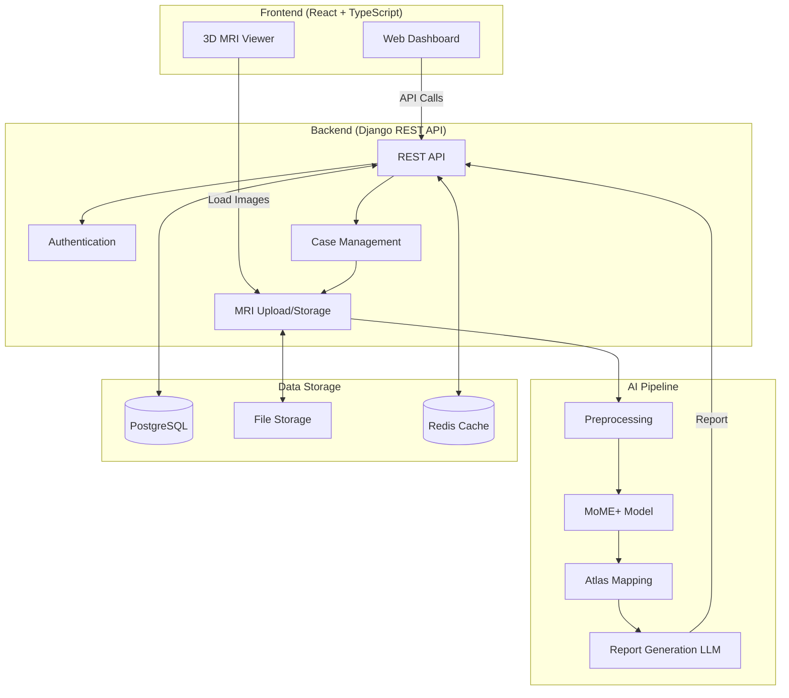

# Expert-Guided Multimodal AI Ecosystem for Brain Tumor Segmentation

An end-to-end AI-powered medical imaging platform combining advanced deep learning for brain tumor segmentation with LLM-based medical report generation. This system features a MoME+ (Mixture of Modality Experts) architecture with continual learning capabilities, integrated with a comprehensive web-based dashboard for clinical use.

## Project Overview

This Final Year Project (FYP) develops a complete ecosystem for automated brain tumor analysis:

1. **MoME+ Segmentation Model**: Multi-modal MRI segmentation using modality-specific expert networks with hierarchical gating
2. **Continual Learning**: Elastic Weight Consolidation (EWC) for knowledge retention across tasks/datasets
3. **LLM Report Generation**: Fine-tuned medical LLM (MedAlpaca/MedGemma) for structured report generation
4. **Clinical Dashboard**: Full-stack web application for case management and 3D MRI visualization
5. **Atlas Mapping**: Brain atlas integration for anatomical localization of tumors

## Key Features

### AI/ML Components
- **Multi-Modal Segmentation**: Processes T1, T2, T1CE, and FLAIR MRI sequences
- **Modality Expertise**: Separate expert networks optimized for each MRI modality
- **Hierarchical Fusion**: Intelligent gating network for dynamic expert combination
- **Attention Mechanisms**: CBAM/SE modules for enhanced feature extraction
- **Continual Learning**: Task-incremental and class-incremental learning scenarios
- **Report Generation**: Automated medical report creation from segmentation results
- **Synthetic Data Generation**: LLM-based synthetic training data for report model

### Clinical Dashboard
- **User Management**: Role-based access (Doctor, Radiologist, Admin)
- **Case Management**: Complete CRUD operations for patient cases
- **3D MRI Viewer**: Interactive visualization with Niivue
- **Multi-Modal Upload**: Support for uploading all MRI modalities
- **Real-time Updates**: Asynchronous processing with status tracking
- **Responsive Design**: Modern UI with dark theme

## System Architecture



## Repository Structure

```
An-Expert-Guided-Multimodal-AI-Ecosystem/
├── frontend/                      # React dashboard application
│   ├── src/
│   │   ├── components/           # React components (MRI Viewer, etc.)
│   │   ├── pages/                # Page components
│   │   ├── contexts/             # React contexts (Auth, Notifications)
│   │   ├── services/             # API client
│   │   └── types/                # TypeScript definitions
│   ├── package.json
│   └── README.md                 # Frontend documentation
│
├── backend/                       # Django REST API
│   ├── medical_ai_backend/       # Project configuration
│   ├── users/                    # User management app
│   ├── cases/                    # Case and MRI management
│   ├── inference/                # AI inference orchestration
│   ├── reports/                  # Report generation
│   ├── requirements.txt
│   └── README.md                 # Backend documentation
│
├── model/                         # AI/ML components (to be organized)
│   ├── segmentation/             # MoME+ model implementation
│   ├── continual_learning/       # EWC and replay mechanisms
│   ├── atlas_mapping/            # Brain atlas integration
│   ├── llm_fine_tuning/          # Report generation model
│   └── preprocessing/            # Data preprocessing pipelines
│
├── data/                          # Data directory (gitignored)
│   ├── raw/                      # Raw datasets (BraTS, OASIS, ISLES)
│   ├── processed/                # Preprocessed data
│   └── experiments/              # Training outputs
│
├── configs/                       # Configuration files
│   ├── train_config.yaml
│   ├── model_config.yaml
│   └── inference_config.yaml
│
├── diagrams/                      # Architecture diagrams (PlantUML)
├── docs/                          # Additional documentation
├── paper.tex                      # IEEE research paper
├── references.bib                 # Bibliography
└── README.md                      # This file
```

## Quick Start

### Prerequisites

- **For Backend/API:**
  - Python 3.12+
  - PostgreSQL 14+ (or SQLite for dev)
  - Redis 6+

- **For Frontend:**
  - Node.js 18+
  - npm or yarn

- **For ML Training:**
  - Python 3.10+
  - CUDA-compatible GPU (recommended)
  - PyTorch 2.0+

### Installation & Setup

#### 1. Clone the Repository
```bash
git clone https://github.com/your-username/An-Expert-Guided-Multimodal-AI-Ecosystem.git
cd An-Expert-Guided-Multimodal-AI-Ecosystem
```

#### 2. Backend Setup
```bash
cd backend

# Create virtual environment
python -m venv .venv
.venv\Scripts\activate  # On Windows
# source .venv/bin/activate  # On macOS/Linux

# Install dependencies
pip install -r requirements.txt

# Configure environment
cp .env.example .env
# Edit .env with your settings

# Run migrations
python manage.py migrate

# Create superuser
python manage.py createsuperuser

# Start server
python manage.py runserver
```

Backend will be available at `http://localhost:8000`

For detailed backend setup, see [backend/README.md](backend/README.md)

#### 3. Frontend Setup
```bash
cd frontend

# Install dependencies
npm install

# Configure environment
cp .env.example .env
# Edit .env if needed

# Start development server
npm run dev
```

Frontend will be available at `http://localhost:5173`

For detailed frontend setup, see [frontend/README.md](frontend/README.md)

#### 4. Start Redis (for async tasks)
```bash
# Windows (WSL or native)
redis-server

# macOS (Homebrew)
brew services start redis

# Linux
sudo systemctl start redis
```

#### 5. Start Celery Worker (optional, for AI inference)
```bash
cd backend
celery -A medical_ai_backend worker -l info
```

## AI Model Components

### MoME+ Segmentation Architecture

The core segmentation model uses a Mixture of Modality Experts approach:

- **4 Expert Networks**: One 3D U-Net per MRI modality (T1, T2, T1CE, FLAIR)
- **Hierarchical Gating**: Multi-level gating network that learns optimal expert fusion
- **Attention Modules**: CBAM (Convolutional Block Attention Module) or SE (Squeeze-and-Excitation) blocks
- **Output Classes**: 
  - Whole Tumor (WT)
  - Tumor Core (TC)
  - Enhancing Tumor (ET)

### Continual Learning

Implements two strategies to prevent catastrophic forgetting:

1. **Elastic Weight Consolidation (EWC)**: Regularizes important weights during new task learning
2. **Experience Replay**: Maintains a buffer of samples from previous tasks

**Learning Scenarios:**
- Task-Incremental: Sequential learning on BraTS → OASIS → ISLES
- Class-Incremental: Progressive lesion type learning

### LLM Report Generation

Fine-tuned medical language model for structured report generation:

- **Base Model**: MedAlpaca-7B or MedGemma-4B
- **Fine-tuning**: LoRA/PEFT for efficient adaptation
- **Input**: JSON schema with segmentation results and atlas mapping
- **Output**: Structured radiology report

**Training Data:**
- Synthetic JSON-to-report pairs generated via LLM prompting
- Addresses scarcity of paired segmentation-report data

### Brain Atlas Mapping

Integration with neuroanatomical atlases:

- Maps segmented tumor regions to anatomical structures
- Provides precise localization for clinical context
- Enhances report generation with anatomical detail

## Datasets

The project uses multiple medical imaging datasets:

| Dataset | Task | Modalities | Samples |
|---------|------|------------|---------|
| **BraTS 2024** | Brain Tumor Segmentation | T1, T1CE, T2, FLAIR | 1,251+ |
| **OASIS** | Alzheimer's Disease | T1, T2, FLAIR | Variable |
| **ISLES** | Ischemic Stroke Lesion | T1, T2, FLAIR | Variable |

## Research Contributions

1. **Modality Expertise with Hierarchical Fusion**: Novel gating mechanism for multi-modal medical image segmentation
2. **Continual Learning for Medical AI**: Application of EWC to multi-task brain lesion segmentation
3. **LLM-Based Report Synthesis**: Synthetic data generation and fine-tuning pipeline for automated report writing
4. **End-to-End Clinical System**: Complete integration from image upload to report delivery

## Current Status

### Completed
- [x] Backend API with authentication and case management
- [x] Frontend dashboard with 3D MRI viewer
- [x] Multi-modal MRI upload and storage
- [x] User role management
- [x] Responsive UI design
- [x] MoME+ model architecture design (in progress)
- [x] Data preprocessing pipelines
- [x] Continual learning framework setup

### In Progress
- [ ] MoME+ model training on BraTS 2024
- [ ] Continual learning experiments
- [ ] Atlas mapping integration
- [ ] LLM fine-tuning for report generation
- [ ] Inference pipeline integration with backend
- [ ] Segmentation result visualization

### Planned
- [ ] Complete AI inference integration
- [ ] Report generation UI
- [ ] Clinician feedback loop
- [ ] Model performance evaluation
- [ ] Deployment to production environment
- [ ] User acceptance testing

## Future Work

### Short-term (Next 3-6 months)
- **Complete AI Integration**: Full pipeline from MRI upload to report generation
- **Advanced Visualization**: Segmentation overlay on MRI scans with color-coded regions
- **Performance Optimization**: Model quantization and inference acceleration
- **Clinical Validation**: Collaboration with radiologists for model evaluation

### Medium-term (6-12 months)
- **Multi-Institutional Deployment**: Scale to multiple hospitals/clinics
- **Federated Learning**: Privacy-preserving collaborative learning across institutions
- **Active Learning**: Intelligent sample selection for annotation
- **Real-time Collaboration**: WebSocket-based multi-user case viewing

### Long-term (1-2 years)
- **Expanded Modalities**: Support for CT, PET, and other imaging modalities
- **Multi-Disease Support**: Extend to other neurological conditions
- **Clinical Decision Support**: Integration with treatment planning systems
- **Mobile Application**: iOS/Android apps for on-the-go case review
- **FDA/CE Approval**: Regulatory approval for clinical use
- **Commercial Deployment**: SaaS platform for medical imaging AI

### Research Directions
- **Uncertainty Quantification**: Bayesian deep learning for prediction confidence
- **Explainable AI**: Visual explanations for model predictions (Grad-CAM, attention maps)
- **Few-Shot Learning**: Adaptation to rare tumor types with limited data
- **Multi-Task Learning**: Simultaneous segmentation, classification, and survival prediction
- **Generative Models**: Synthetic MRI generation for data augmentation
- **Graph Neural Networks**: Modeling spatial relationships in brain structures

## Documentation

- **Frontend**: [frontend/README.md](frontend/README.md)
- **Backend**: [backend/README.md](backend/README.md)
- **API Documentation**: Available at `/api/docs/` when backend is running
- **Research Paper**: [paper.tex](paper.tex) - IEEE format
- **Architecture Diagrams**: [diagrams/](diagrams/)

## Testing

### Backend Tests
```bash
cd backend
python manage.py test
```

### Frontend Tests
```bash
cd frontend
npm run test  # (when test suite is added)
```

### ML Model Tests
```bash
cd model
pytest tests/
```

## Docker Deployment

Build and run the entire stack:

```bash
# Build images
docker-compose build

# Start all services
docker-compose up -d

# View logs
docker-compose logs -f
```

Services will be available at:
- Frontend: `http://localhost:3000`
- Backend API: `http://localhost:8000`
- Admin Panel: `http://localhost:8000/admin`

## License

This project is part of an academic Final Year Project. All rights reserved.

For academic use and collaboration inquiries, please contact the maintainers.

## Team

**Final Year Project - Computer Engineering**  
School of Electrical Engineering and Computer Science (SEECS)

- **Student**: Farhan Kashif, Ahmed Sultan
- **Supervisor**: [Supervisor Name]
- **Institution**: [University Name]

## Acknowledgments

- BraTS Challenge organizers for the brain tumor dataset
- OASIS and ISLES consortiums for additional datasets
- Open-source contributors of PyTorch, Django, React, and other frameworks
- Medical professionals providing domain expertise

## Contact

For questions, issues, or collaboration:
- Email: [your-email@example.com]
- GitHub Issues: [Project Issues Page]

## References

Key papers and resources:

1. MoME: Mixture of Modality Experts for Medical Image Segmentation
2. Elastic Weight Consolidation for Continual Learning
3. BraTS Challenge: Brain Tumor Segmentation
4. MedAlpaca: Fine-tuning Large Language Models for Medical Applications

See [references.bib](references.bib) for complete bibliography.

---

**Status**: Active Development | **Last Updated**: December 2025
